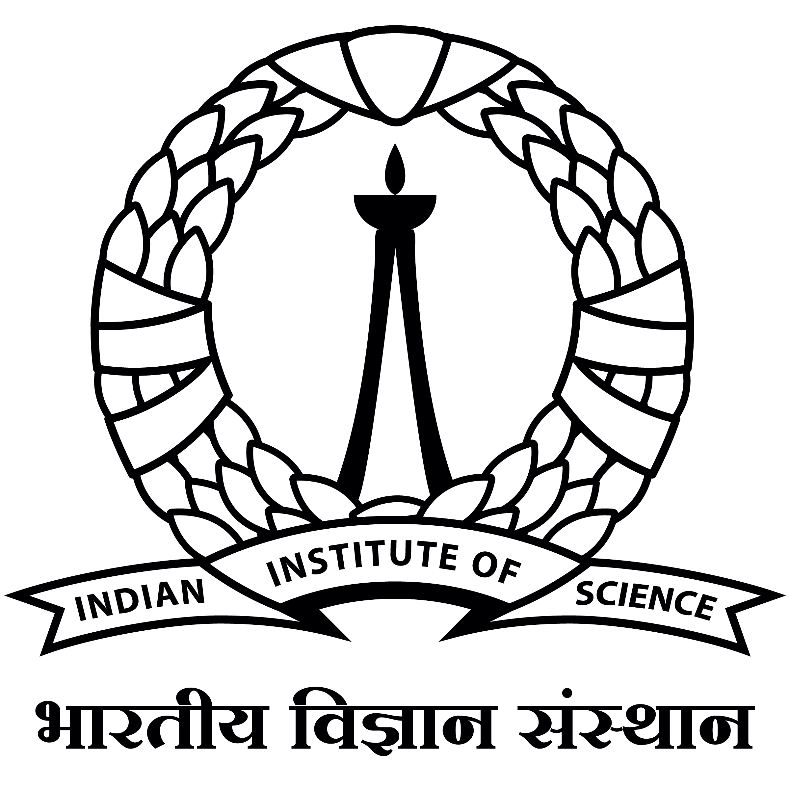

Hey, my name is Akansh Maurya and I am a student pursuing electrical engineering from the Institute of Engineering and Technology, Lucknow. My research interest lies in the field of machine learning, signal processing, and control systems. So, in previous centuries, scientists like Fourier were able to solve complex mathematical problems but there still exist a vast number of unformulated problems that we encounter remaining unsolved. I believe that data analysis is the key, in fact, I call data analysis the new alchemy :D. I am currently doing a research internship at SPIRE lab, IISC Bengaluru, under the guidance of Dr. Prashanta Kumar Ghosh. The project is the detection of asthmatic patients based on cough sound and other phonation. Till now it's a great experience and I am getting familiar with app development and model deployment. Prior to this, I worked as a research intern at the ERTS lab, Indian Institute of Technology, Bombay. This project was guided by Prof. Kavi Arya and Omkar sir. The project was titled An efficient way to verify and validate College ID cards using Deep Learning. You can read more about this project here. Other than having a penchant for the above-mentioned field, some of my hobbies include reading about geopolitics, world history, and science fiction. I enjoy all kinds of sports from cricket to badminton, to be honest, I feel that I am a jack of all but master of none.

<tr>
  
  
  <td align="center" width="16%" style = "vertical-align: middle; background-color: rgba(255, 255, 255, 1)">
    
  </td>
  
  <td align="center" width="16%" style = "vertical-align: middle; background-color: rgba(255, 255, 255, 1)">
    
  </td>
  
  <td align="center" width="16%" style = "vertical-align: middle; background-color: rgba(255, 255, 255, 1)">
    
  </td>
  
  <td align="center" width="16%" style = "vertical-align: middle; background-color: rgba(255, 255, 255, 1)">
    
  </td>

  <td align="center" width="16%" style = "vertical-align: middle; background-color: rgba(255, 255, 255, 1)">
       
  
  
</tr>